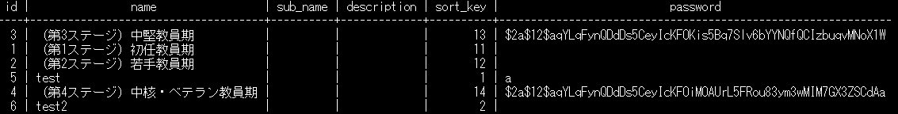

# 動作環境
- OS: Unix 系（Windows では WSL 等をお使いください）
- Node.js: v18.19.0
- Docker
- Docker Compose (v2)

# setup
git clone実行後、ルートディレクトリで以下のコマンドを実行します。
```
script/setup.sh
```

# 開発

コンテナのビルド
```
docker compose -f docker-compose.dev-local.yml build
```

コンテナ起動
```
docker compose -f docker-compose.dev-local.yml up -d
```

appコンテナ内に移動
```
docker container exec -it chiloportfolio sh
```

コンテナのdown
```
docker compose -f docker-compose.dev-local.yml down
```

アプリケーションの移動（appコンテナ内）
```
npm run dev
```
## Visual Studio CodeでdevContainerを使用する場合
1. Docker および Docker Compose をインストール
2. Visual Studio Code に拡張機能「Dev - Containers」をインストール
3. 当READMEのsetupを実行
4. コマンドパレット で「Remote-Containers: Open Folder in Container...」を選択し、chiloportfolioディレクトリを選択

# 開発サーバー（または本番サーバー）

1. 下記をインストール
   * Docker
   * Docker Compose (v2)
   * Git  
1. 適当なディレクトリへ移動
   ```
   cd /opt
   ```
1. chiloportfolio のソースを取得
   ```
   git clone https://github.com/npocccties/chiloportfolio.git
   ```
   * 既にディレクトリが存在するならば `sudo rm -rf chiloportfolio` にて削除してください
1. chiloportfolio へ移動
   ```
   cd chiloportfolio
   ```
1. `*.sh` に権限付与
   ```
   sudo chmod 755 *.sh
   ```

1. ルートディレクトリで、`setup.sh` を実行する

1. デプロイ
   ```
   ./app_start.sh
   ```
   * 権限付与後の `app_start.sh` は何度でも実行可能です

1. 備考  
   コンテナ起動  
   ```
   chiloportfolio/app_start.sh
   ```

   コンテナ停止  
   ```
   chiloportfolio/app_stop.sh
   ```

   コンテナ再起動  
   ```
   chiloportfolio/app_restart.sh
   ```
   * `app_stop.sh` と `app_start.sh` を呼びます

   全てのコンテナログの確認  
   ```
   docker container logs -f
   ```
   * -f の後ろにコンテナ名（chiloportfolio）を入れると該当コンテナのみのログが見れます  


# 環境変数

## ビルド時用
.env
| 変数名                               | 説明                                        | デフォルト値         |必須/任意|
| :----------------------------------- | :------------------------------------------ | :------------------- | :---- |
|LOG_LEVEL|ログレベル<br>'fatal', 'error', 'warn', 'info', 'debug', 'trace' or 'silent'|-|必須|
|LOG_MAX_SIZE|ログファイルサイズ<br>単位には k / m / g のいずれか指定|100m|必須|
|LOG_MAX_FILE|ログファイルの世代数|7|必須|

## Next.jsアプリケーション用
Next.jsアプリケーションでは、環境毎に以下のパターンで.envファイルを参照します。

| ファイル名 |	読み込まれるタイミング
| :--------- | :--------- | 
|.env.local |	毎回
|.env.development |	next dev 時のみ
|.env.production	| next start 時のみ

https://nextjs.org/docs/pages/building-your-application/configuring/environment-variables

以下の2つの環境変数の値を記述します。

.env.development

.env.production

| 変数名                               | 説明                                        | デフォルト値         |必須/任意|
| :----------------------------------- | :------------------------------------------ | :------------------- | :---- |
|NEXT_PUBLIC_SERVICE_NAME|サービス名|e-ポートフォリオ|必須|
|NEXT_PUBLIC_SERVICE_DESCRIPTION|サービスの説明<br>metaタグに設定される説明です。|e-ポートフォリオは、教育指標毎のオープンバッジの取得状況を確認するサイトです。|必須|
|NEXT_PUBLIC_PORTAL_BASE_URL|ポータルサイトのURL|-|必須|
|NEXT_PUBLIC_WALLET_BASE_URL|バッジウォレットのURL|-|必須|
|NEXT_PUBLIC_COPYRIGHT_LINK|フッターに表示するコピーライトのリンク|-|必須|
|NEXT_PUBLIC_COPYRIGHT|フッターに表示するコピーライト|-|必須|
|NEXT_PUBLIC_CSV_FILE_NAME|CSVダウンロードで指定するファイル名|e-Portfolio|必須|
|NEXT_PUBLIC_HELP_LINK|ヘルプのリンク|-|必須|
|NEXT_PUBLIC_LOGOUT_LINK|オルトロスのログアウトのリンク|-|必須|
|PASSWORD|e-ポートフォリオのアクティベーション画面で入力する利用キー<br>※複数指定時はカンマ区切り|-|必須|
|orthros_login_key_base64|Orthrosから発行されるJWTの署名に対応した公開鍵のbase64エンコード形式|-|必須|
|BCRYPT_SALT|アクティベーションの利用キーのハッシュ値のソルト<br>※$の直前にはバックスラッシュを付与してエスケープすること<br>詳細は[こちら](https://github.com/npocccties/chiloportal/tree/develop/backend#%E6%88%90%E9%95%B7%E6%AE%B5%E9%9A%8E%E3%81%AE%E3%83%91%E3%82%B9%E3%83%AF%E3%83%BC%E3%83%89%E3%81%AE%E3%83%8F%E3%83%83%E3%82%B7%E3%83%A5%E5%80%A4%E3%81%AE%E7%94%9F%E6%88%90%E3%81%AB%E4%BD%BF%E7%94%A8%E3%81%99%E3%82%8B%E3%81%9F%E3%82%81%E3%81%AE%E3%82%BD%E3%83%AB%E3%83%88%E7%94%9F%E6%88%90)を参照|-|必須|
|ENCRYPTION_KEY|キー入力時の値の暗号化に使用する鍵 ※半角英数32文字<br>暗号化された値はセッションで保持|-|必須|
|ENCRYPTION_IV|キー入力時の値の暗号化に使用するIV ※半角英数16文字<br>暗号化された値はセッションで保持|-|必須|

# 運用手順
## ポータルとの連携（更新手順）
環境変数「NEXT_PUBLIC_PORTAL_BASE_URL」はポータルサイトのURLを示しますので、こちらを環境に応じて適宜変更してください。

## ウォレットとの連携（更新手順）
環境変数「NEXT_PUBLIC_WALLET_BASE_URL」はバッジウォレットのURLを示しますので、こちらを環境に応じて適宜変更してください。

## アクティベーションの設定（更新手順）
* 利用者（教育委員会）が増えた場合、環境変数「PASSWORD」に利用キーをカンマ区切りで増やしてください。
* 環境変数「BCRYPT_SALT」はアクティベーションの利用キーをハッシュ化するためのソルトとして使用します。ハッシュ値はセッションストレージに保存し、簡易的なセッション管理として使用しますので、定期的にソルトの値は更新してください。

## 非表示の教員教育指標の設定（追加手順）
初めに、e-ポートフォリオの教員育成指標選択のプルダウンは、[CHiLO-Portal](https://github.com/npocccties/chiloportal/)の教員教育指標と連動し、成長段階（stage テーブル）の粒度で表示を行います。<br>
また、成長段階は非表示にすることも可能で stage テーブルの password カラムにパスワードに応じたハッシュ値を設定することで、非表示にすることが可能です。<br>
以下、非表示のための手順を記します。
1. ポータルのDjangoの管理画面にログインします<br>
   詳細は[こちら](https://github.com/npocccties/chiloportal/tree/develop/backend#django-%E3%81%AE%E7%AE%A1%E7%90%86%E7%94%BB%E9%9D%A2)を参照
1. Stages の変更メニューを選択します
1. 非表示としたい教員教育指標を選択したうえで、Password の項目に以下を参考にハッシュ値を設定します<br>
詳細は[こちら](https://github.com/npocccties/chiloportal/tree/develop/backend#%E6%88%90%E9%95%B7%E6%AE%B5%E9%9A%8E%E3%81%AE%E3%83%91%E3%82%B9%E3%83%AF%E3%83%BC%E3%83%89%E3%81%AE%E3%83%8F%E3%83%83%E3%82%B7%E3%83%A5%E5%80%A4%E3%81%AE%E7%94%9F%E6%88%90%E3%81%AB%E4%BD%BF%E7%94%A8%E3%81%99%E3%82%8B%E3%81%9F%E3%82%81%E3%81%AE%E3%82%BD%E3%83%AB%E3%83%88%E7%94%9F%E6%88%90)を参照<br>
以下、設定例

1. ハッシュ値を設定したら保存ボタンを押下します